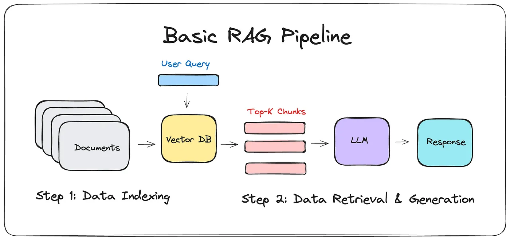

# Build a RAG-Powered LLM Service with Ollama & Open WebUI : A Step-by-Step Guide 🚀

<p align="center">
  
  <br>
  <em>Retrieval-Augmented Generation (RAG) — Image generated by DALL-E</em>
</p>

### Introduction

Large Language Models (LLMs) are powerful, but they have a fundamental
limitation: they rely solely on their pre-trained knowledge and struggle
with retrieving up-to-date or domain-specific information.
**Retrieval-Augmented Generation (RAG)** solves this problem by
integrating an external retrieval mechanism, allowing LLMs to fetch
relevant documents before generating responses.

### **How RAG works**

Briefly speaking, a Retrieval-Augmented Generation (RAG) pipeline
enhances LLMs by integrating a retrieval step before text generation.
When a user inputs a query, the system first converts it into an
embedding using an embedding model. This embedding is then compared to a
database of precomputed document embeddings using a similarity search
algorithm (e.g., cosine similarity). The most relevant documents are
retrieved and passed to the LLM, which generates a response by
incorporating the retrieved context. This approach significantly
improves accuracy and reduces hallucinations by grounding the model’s
output in factual information.

RAG pipelines are particularly useful in applications where access to
up-to-date or domain-specific knowledge is crucial. By dynamically
fetching relevant information instead of relying solely on the LLM’s
pre-trained knowledge, RAG-based systems can provide more precise,
context-aware answers, making them ideal for chatbots, research tools,
and enterprise AI applications. From [this](https://medium.com/@drjulija/what-is-retrieval-augmented-generation-rag-938e4f6e03d1) medium blog post, I have borrowed RAG pipeline schema.

<p align="center">
  
  <br>
  <em> RAG Pipeline in General — Image from <a href="https://medium.com/@drjulija/what-is-retrieval-augmented-generation-rag-938e4f6e03d1" target="_blank">here</a> </em>
</p>

### What Are We going to do?

In this post we’ll cover:

- Setting up [**<u>Ollama</u>**](https://ollama.com/) to serve an LLM
  efficiently

- Configuring [**<u>Open
  WebUI</u>**](https://github.com/open-webui/open-webui) to interact
  with the model

- Integrating a **Retrieval Augmented Generation(RAG)** pipeline to
  enhance responses

- Optimizing parameters for better accuracy

By the end, you’ll have a working RAG pipeline integrated with **Open
WebUI**, enabling smarter and more context-aware AI responses. In this
tutorial, we will use **Ollama as the LLM backend**, integrating it with
**Open WebUI** to create an interactive RAG system. Let’s dive in! 🚀

### Ollama and Its Benefits

<p align="center">
  
  <br>
  <em> <a href="https://ollama.com" target="_blank">Ollama</a> Framework </em>
</p>


[**<u>Ollama</u>**](https://ollama.com/) is a powerful, lightweight
framework designed for efficiently running and managing **Large Language
Models (LLMs) on local or server environments**. It provides a literally
optimized runtime for models like **LLaMA, Mistral, and Gemma**, making
it a great choice for **low-latency inference** without relying on
cloud-based APIs. Key Benefits of Ollama for RAG Systems:

1.  **Optimized Model Execution** — Ollama is designed for efficient
    **GPU and CPU inference**, leveraging techniques like quantization
    to reduce memory footprint while maintaining high performance.

2.  **Custom Model Management** — Users can **fine-tune and package**
    their own models for domain-specific tasks, making it ideal for
    specialized RAG applications.

3.  **Local & Private Deployment** — Unlike cloud-hosted models, Ollama
    allows **fully local execution**, ensuring **data privacy** and
    reducing latency.

4.  **Simple API for Integration** — With a clean REST API, Ollama makes
    it easy to integrate LLMs into **retrieval-based workflows** without
    complex setup.

5.  **Supports Embedding Models** — Essential for **vector search**,
    Ollama supports running embedding models alongside LLMs, enabling
    **semantic retrieval** for RAG applications.

Next, let’s discuss Open WebUI and how it fits into the workflow.

### Open WebUI and Its Role in RAG

<p align="center">
  
  <br>
  <em> <a href="https://github.com/open-webui/open-webui" target="_blank">Open WebUI</a> Interface </em>
</p>

[**<u>Open WebUI</u>**](https://github.com/open-webui/open-webui) is an
open-source, user-friendly interface designed for managing and
interacting with **local or remote LLMs**, including those running on
**Ollama**. It provides a **chat-based UI**, allowing users to send
queries and receive responses seamlessly.

#### Key Benefits of Open WebUI for RAG Systems:

1.  **Intuitive Interface** — Provides a clean, **browser-based chat
    UI** for interacting with LLMs, making it easy to test and deploy AI
    applications.

2.  **Supports Local and Remote Models** — Can connect to models running
    on **Ollama, LM Studio, and API-based LLMs**, offering flexibility
    in deployment.

3.  **Easy Model Management** — Allows switching between **different
    LLMs and embedding models** without complex configurations.

4.  **Custom Prompting & Plugins** — Supports **custom system prompts**,
    enabling better control over LLM behavior in **retrieval-augmented
    workflows**.

5.  **Integration with RAG Pipelines** — Acts as a **frontend** for
    querying **retrieval-augmented models**, making it an ideal choice
    for testing and deploying RAG-based chatbots.

6.  **REST API interface —** allows you to integrate the RAG-powered LLM
    into other applications using REST API webservices.

In this tutorial, Open WebUI will serve as the **interactive interface**
for our **RAG system**, enabling seamless user interaction with the
**retrieval-enhanced LLM**. Next, let’s set up the required components
and begin building the system! 🚀

### Installing Ollama using Docker

To run **Ollama** in a containerized environment, we will set it up
using **Docker**. This ensures **easy deployment**, **portability**, and
**isolation** from the host system. Before continue**,** If you are
going to use gpu, you must have installed NVIDIA Container Toolkit. See
installation instruction
[here](https://docs.nvidia.com/datacenter/cloud-native/container-toolkit/latest/install-guide.html#setting-up-nvidia-container-toolkit).

#### Step 1: Install Docker

Before proceeding, make sure you have Docker installed. If not, install
it using the following commands:

For Debian/Ubuntu:

```bash
sudo apt update && sudo apt install -y docker.io
```

For macOS (via Homebrew):

```bash
brew install docker
```

**For Windows:**

Download and install [**<u>Docker
Desktop</u>**](https://www.docker.com/products/docker-desktop/) from
Docker’s official website. Or you can use WSL to emulate Linux.

#### Step 2: Pull the Ollama Docker Image

Once Docker is installed, pull the latest Ollama image(Use sudo if
needed):
```bash
docker pull ollama/ollama:latest
```

#### Step 3: Run Ollama **Container**

Now, start the Ollama container with the necessary configurations:
```bash
docker run -d --name ollama \\  
--gpus=all \\  
-p 11434:11434 \\  
-v ollama_data:/root/.ollama \\  
ollama/ollama:latest
```


**Explanation of Flags:**

- ```-d``` → Runs the container in detached mode.

- ```--gpus=all``` → Enables GPU support (if available).

- ```-p 11434:11434``` → Maps Ollama's default API port to the host.

- ```-v ollama_data:/root/.ollama``` → Persists downloaded models across
  container restarts.

#### Step 4: Verify the Installation

To check if Ollama is running, use:
```bash
docker ps
```

You should see the **ollama** container running. Test Ollama by running:
```bash
curl http://localhost:11434/api/tags
```

If it returns an empty list (\[\]), the setup is successful, and you can
start downloading and using models.

### Installing Open-WebUI using Docker

You can find a detailed instruction for installing Open-WebUI in its
[official github repository](https://github.com/open-webui/open-webui)
but here is brief instruction for installing it:

#### If Ollama is on your computer, use this command:
```bash
docker run -d -p 3000:8080 --add-host=host.docker.internal:host-gateway
-v open-webui:/app/backend/data --name open-webui --restart always
ghcr.io/open-webui/open-webui:main
```


#### If Ollama is on a Different Server, use this command:
```bash
docker run -d -p 3000:8080 -e OLLAMA_BASE_URL=https://example.com -v
open-webui:/app/backend/data --name open-webui --restart always
ghcr.io/open-webui/open-webui:main
```


#### To run Open WebUI with Nvidia GPU support, use this command:
```bash
docker run -d -p 3000:8080 --gpus all
--add-host=host.docker.internal:host-gateway -v
open-webui:/app/backend/data --name open-webui --restart always
ghcr.io/open-webui/open-webui:cuda
```


now, you can see the panel at: <http://localhost:3000> or
<http://127.0.0.1:3000>

Click on **Get started**, enter **Name**,**Email** and **Password** for
administration and enter the Open Webui:

<p align="center">
  
  <br>
  <em> Open Webui Panel </em>
</p>


As you can see, there is a complete inference panel where you can define
users, groups, and comprehensive administrative facilities for managing
your users. However, there is no model available to use yet. Now, let’s
add a model to Ollama so we can start using it here!

### Pulling a model in ollama

Now that you have everything set, you need to pull a model for ollama.
choose your model from [ollama models
repository](https://ollama.com/search). Pay attention to the capacity of
your machine and choose the suitable version of the model. I have
choosen
[3b-instruct-fp16](https://ollama.com/library/llama3.2:3b-instruct-fp16)
from [llama3.2](https://ollama.com/library/llama3.2/tags) family to fit
into my RTX4060 GPU with 8GB of Ram. for downloading the model:

```bash
docker exec -it ollama ollama run llama3.2:3b-instruct-fp16
```

By doing this, ollama download this model, and you can use it both in
the terminal:

<p align="center">
  
  <br>
</p>

Or in Open WebUI panel:

<p align="center">
  
  <br>
</p>

or even via Ollama Rest API:

```bash
curl http://localhost:11434/api/generate -d '{  
"model": "llama3.2:3b-instruct-fp16",  
"prompt": "Why is the sky blue?",  
"stream": false  
}'
```

Now, you can download different models and test them to find the one
that best fits your application.

### **Integrating RAG via Open-Webui**

Now that we have successfully built our LLM service, we can define our
RAG with the desired model and documents. To do this, we need to create
a so-called **“Knowledge”**, a collection of documents that will serve
as the foundation for our RAG system. Next, we create a model that
generates responses based on this **Knowledge**. Finally, we can use
this model to process queries. That’s it! So:

**STEP1:** in Open WebUI page, from top left, go to **Workspace** and in
**Knowledge** tab, hit (**+)** button to create a new Knowledge. Enter
the name and description and **Create Knowledge**. Now, click on the
newly-created Knowledge and add your desired documents using (+) button
and upload files. I add two simple test file:

file1:

> Hello, my name is John. I work for OpenAI and I get 100000\$ a year.  
> I have a dog named Peter who likes me a lot!

file2:

> Hello, my name is Richard. I work for Deepseek and I get 90000\$ a
> year.  
> I have a cat named Cordellia who is always tired!

<p align="center">
  
  <br>
</p>

Now, you have successfully added two files to your **Knowledge**. You
can always add or delete files, but pay attention if contents of a file
changes, you need to delete the former file from the **Knowledge** and
upload it again. or re-sync the whole Knowledge.

**STEP2:** Now, you need to define the model. in **Workspace** go to
**models** tab, hit (**+)** button to add a new model. Enter the model
name, Select **Base Model** on which you want to create your RAG. Then
in select knowledge, add your already-created Knowledge to this model.
Finally, you have something like this:

<p align="center">
  
  <br>
</p>

press **Save & create** and you have this model in models list now!

Let’s test our RAG:

<p align="center">
  
  <br>
  <em> First Question from the Model </em>
</p>

As you can see, it responded to my question base on the contents of the
files I’ve added.

### Parameters Tuning

Now that we have built our RAG, we need to improve the efficiency of the
pipeline. There are multiple parameters that should be tuned in a RAG
pipeline to optimize the model’s performance. Once again, I want to draw
your attention to this pipeline. There are several crucial parameters
that need to be configured.

<p align="center">
  
  <br>
</p>

In Open WebUi, **Settings\>Admin Settings\>Documents** you can see a lot
of parameters:

<p align="center">
  
  <br>
</p>

**Embedding Model:** The model which is being used to embed query and
documents into vectors. by default
**sentence-transformers/all-MiniLM-L6-v2** but you can change it base on
your case just by writing the name and hit the download button beside
that.

**Top K:** Number of relevant documents to be retrieved

**RAG Template:** Query by which you ask model to finds the relevant
documents and retrieve the answer. You can consider additional tips to
answer in the template. By default the RAG template in Open WebUI is:

```html
### Task:
Respond to the user query using the provided context, incorporating inline citations in the format [source_id] **only when the <source_id> tag is explicitly provided** in the context.

### Guidelines:
- If you don't know the answer, clearly state that.
- If uncertain, ask the user for clarification.
- Respond in the same language as the user's query.
- If the context is unreadable or of poor quality, inform the user and provide the best possible answer.
- If the answer isn't present in the context but you possess the knowledge, explain this to the user and provide the answer using your own understanding.
- **Only include inline citations using [source_id] when a <source_id> tag is explicitly provided in the context.**  
- Do not cite if the <source_id> tag is not provided in the context.  
- Do not use XML tags in your response.
- Ensure citations are concise and directly related to the information provided.

### Example of Citation:
If the user asks about a specific topic and the information is found in "whitepaper.pdf" with a provided <source_id>, the response should include the citation like so:  
* "According to the study, the proposed method increases efficiency by 20% [whitepaper.pdf]."
If no <source_id> is present, the response should omit the citation.

### Output:
Provide a clear and direct response to the user's query, including inline citations in the format [source_id] only when the <source_id> tag is present in the context.

<context>
{{CONTEXT}}
</context>

<user_query>
{{QUERY}}
</user_query>
```

**Chunk Size and Chunk Overlap:** You may have long documents which
needs to be separated in order to be easier searched.

The other type of parameters which needs to be set is belongs to LLM
model itself. You may find these parameters by going to
**Workspace**\>**Models**, find your model and hit the Edit button:

<p align="center">
  
  <br>
</p>

Then, in the model’s page, in front of **Advanced Params** press
**Show** to find these parameters. As you can see, numerous parameters
appeared which you must be cautious for changing them. The most
important parameter I believe is the **temperature** which you can
adjust to control response randomness. A lower value (e.g., 0.6) makes
responses more deterministic, while a higher value (e.g., 0.8) increases
creativity and diversity.

Also, **Max Tokens (num_predict)** as stated in Open-WebUI hint, sets
the maximum number of tokens the model can generate in its response.
Increasing this limit allows the model to provide longer answers, but it
may also increase the likelihood of unhelpful or irrelevant content
being generated. (Default: 128)

### Using Open WebUI as a REST API Web Service

Open WebUI provides a REST API interface, allowing you to integrate the
RAG-powered LLM into other applications. You can send requests to the
API endpoint to retrieve model responses programmatically.

### Conclusion

Congratulations! You’ve successfully built a powerful RAG-powered LLM
service using Ollama and Open WebUI. With this setup, you can harness
the strengths of retrieval-augmented generation to create intelligent,
context-aware applications. Whether you’re developing chatbots, research
tools, or enterprise AI solutions, this pipeline provides a strong
foundation for delivering accurate and insightful responses.

The possibilities don’t stop here — explore optimizations like
fine-tuning models with domain-specific data, or scaling the system for
larger workloads. Keep innovating, and let your AI-powered applications
reach new heights! 🚀

### References:

[<u>**How I built a Simple Retrieval-Augmented Generation (RAG)
Pipeline?**  
*What’s RAG in
LLMs*</u>medium.com](https://medium.com/@drjulija/what-is-retrieval-augmented-generation-rag-938e4f6e03d1)

[<u>**GitHub - open-webui/open-webui: User-friendly AI Interface
(Supports Ollama, OpenAI API, ...)**  
*User-friendly AI Interface (Supports Ollama, OpenAI API, ...) -
open-webui/open-webui*</u>github.com](https://github.com/open-webui/open-webui)

[<u>**ollama/docs at main · ollama/ollama**  
*Get up and running with Llama 3.3, DeepSeek-R1, Phi-4, Gemma 2, and
other large language models. - ollama/docs at
main…*</u>github.com](https://github.com/ollama/ollama/tree/main/docs)
